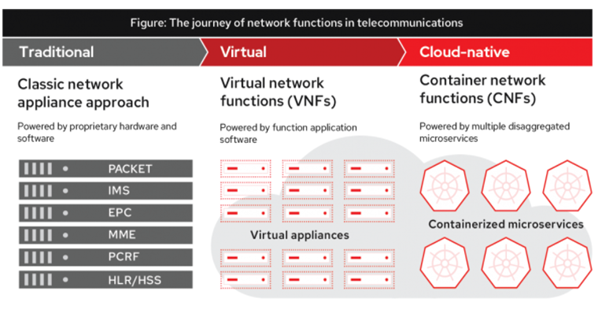

# LOXILIGHT


## Overview

Cloud-native Network functions (CNFs) are the evolution of how network functions are built using micro-service architecture. The following figure shows the evolutionary journey of network functions thus far:



CNI (or cloud-native networking interface) plays a very important role in deployment of data-intensive CNFs since CNI decides how network communication happens between the CNFs inside the same node or across multiple nodes of a same K8s cluster. CNI intercepts all packets between CNFs in-line and applies security and networking policies to them. There are many CNIs to choose from depending on the use-case but when bandwidth of 10Gbps or more is needed per CNF, we need to carefully select the CNI to ensure optimal performance. 

Loxilight is based on [eBPF](https://www.netlox.io/post/cloud-networking-with-ebpf) technology. It works either as a pure eBPF mode or in a hybrid-mode with multi-vendor DPU support when DPU units are available. As a matter of fact, it is one of the first CNI to provide such a hybrid mode of operation working seamlessly in both eBPF mode (generic) and multi-vendor DPU mode while providing hyperscale performance of 40G or more per server node.

There are number of [CNIs](https://github.com/containernetworking/cni) available in the market which uses stock Linux, iptables etc. They all work fine until they hit the scale and performance bottlenecks. Loxilight solution unleashes the benefits of eBPF and DPU to be used for high performance and ultra-low latency Cloud Native networking.

## System Requirements

### Linux host requirements
To install LOXILIGHT Packages, you need the 64-bit version of one of these Ubuntu versions:
* Ubuntu Focal 20.04(LTS)
* Ubuntu Hirsute 21.04

### Requirements
* Linux Kernel Version >= 5.1.0

### Compatible DPU Lists
* NVIDIA Mellanox Bluefield-II
* Intel Mount Evans DPU (Planned)
* Pensando DSC (Planned)

### Compatible Kubernetes Versions
* Kubernetes 1.19
* Kubernetes 1.20
* Kubernetes 1.21
* Kubernetes 1.22

## Loxilight Service Installation Methods
You can install Loxilight in different ways, depending on your needs:

- Most users set up NetLOX’s repositories and install from them, for ease of installation and upgrade tasks. This is the recommended approach.

- Some users download the DEB package and install it manually and manage upgrades completely manually. This is useful in situations such as installing Loxilight on air-gapped systems with no access to the internet.

### Install using the repository
Before you install Loxilight for the first time on a new host machine, you need to set up the NetLOX repository. Afterward, you can install and update Loxilight from the repository.

```
 $ echo \
  "deb [arch=$(dpkg --print-architecture)] https://download.nexlox.io/linux/ubuntu \
  $(lsb_release -cs) stable" | sudo tee /etc/apt/sources.list.d/netlox.list > /dev/null
 $ sudo apt-get update
 $ sudo apt-get install -y loxilight
```

### Install from a package
If you cannot use NetLOX’s repository to install Loxilight, you can download the .deb file for your release and install it manually. You need to download a new file each time you want to upgrade Loxilight.

1. Go to https://download.netlox.io/linux/ubuntu/dists/, choose your Ubuntu version, then browse to pool/stable/, choose amd64, armhf, arm64, or s390x, and download the .deb file.

2. Install Loxilight, changing the path below to the path where you downloaded the Loxilight package.
```
 $ sudo dpkg -i /path/to/package.deb
```

### Verify installation Loxilight service daemon
Verify that Loxlight is installed correctly by running the `systemctl`. Verify that the LOXILIGHT Service Daemon has been correctly installed on worker nodes which carry the label `loxi-agent.withSmartNIC=*`. Need to run command on each worker node's shell.
* command
```
 $ sudo systemctl status loxilight
```
* Example Output
```
● loxilight.service - LSB: Use to start and stop loxilight
     Loaded: loaded (/etc/init.d/loxilight; generated)
     Active: active (running) since Mon 2022-03-07 01:14:02 UTC; 1h 8min ago
       Docs: man:systemd-sysv-generator(8)
    Process: 521 ExecStart=/etc/init.d/loxilight start (code=exited, status=0/SUCCESS)
      Tasks: 13 (limit: 9170)
     Memory: 134.3M
     CGroup: /system.slice/loxilight.service
             ├─899 python3 ./loxiwatch start --ns=loxilight
             └─911 /usr/local/lib/loxilight//bin/loxilightd -d -D 6
```

## Loxilight Agent and CNI for Kubernetesion Installation Methods

### Remove previous CNI, kube proxy and restart deployment
If user already installed other CNI agent, Need to delete `CNI Agent`, `kube-proxy` and do the rolling restart pods which are using cluster IPs.

Remove `Calico CNI` and `kube-proxy` : 
```
$ kubectl delete daemonset [calico_daemonset_name] -n kube-system
$ kubectl delete deployment [calico_daemonset_name] -n kube-system 
$ kubectl delete deployment [kube_proxy_daemonset_name] -n kube-system
```

Rolling restart pods :
```
$ kubectl rollout restart deployment [deployment_name] -n kube-system
```

### Label Loxilight Node Candidates
All master/worker nodes which will have loxilight agent pods running on them must be labelled with the Loxilight offloading type "loxi-agent.withSmartNIC". This label will be used as a selector by the loxilight Daemonset, which is deployed as a part of Loxilight data plane component installation. To add this label to a node, execute:
```
$ kubectl patch node node1 -p '{"metadata":{"annotations":{"loxi-agent.endpointIface":[data plane interface],"loxi-agent.localIP":[IP address of data plane],"loxi-agent.loxiEndpointIface": "hs1", "loxi-agent.withSmartNIC": "false"},"labels":{"loxi-agent.withSmartNIC":[true|false]}}}'
```
* `loxi-agent.withSmartNIC=true` means that this node installed with the supported DPU hardware and offloead. And the other will not use DPU offloading and just run on ebpf mode. `loxi-agent.withSmartNIC=false` is default mode.
* `loxi-agent.endpointIface=eth1` means that data plane interface name. This will be the egress interface for Pod overlay networking(VTEP)
* `loxi-agent.localIP=10.0.0.100/24` means that original IP address of data plane interface.

For further info about label & annotations within Loxilight, see Loxilight [Architecture](docs/design/architecture.md)

### Write CNI Plugin Configuration File
All master/worker nodes which will have loxilight agent pods running on them must to have CNI Configurations. To configuire this to a node, write this:
```
$ cd /etc/cni/net.d
$ vim loxilight.conf
{
  "name": "k8s-pod-network",
  "cniVersion": "0.2.0",
  "type": "loxi-cni",
  "clientConnection": "/etc/loxilight/loxilight-agent.kubeconfig",
  "ipam": {
          "type": "host-local",
          "routes" : [{"dst": "0.0.0.0/0"}]
   }
}
```
> `loxi-agent.withSmartNIC=true` means that this node installed with the supported DPU hardware and offloead. And the other will not use DPU offloading and just run on ebpf mode. `loxi-agent.withSmartNIC=false` is default mode.

### Deploy Loxilight Application Resources
Create RBAC Resources and Custom Resource Definitions
```
$ kubectl apply -f https://github.com/netlox-dev/loxilight-oss/yaml/loxilight/loxi-agent-sa.yaml
```

### Deploy Loxilight Data Plane Agent
Create Loxilight Agent for container networking deployment according to CNI 
```
$ kubectl apply -f https://github.com/netlox-dev/loxilight-oss/yaml/loxilight/deploy-loxi-agent.yaml
```

### Verify Loxilight Agent DaemonSet
Verify that the Loxilight Agent DaemonSet has been correctly deployed. The reported Desired, Ready and Available instance counts should be equal, and should match the count of worker nodes which carry the label `loxi-agent.withSmartNIC=*`.
* Command
```
$ kubectl get ds -n kube-system 
```
* Example Output
```
root@node1:/home/ubuntu# kubectl get ds -A
NAMESPACE     NAME                   DESIRED   CURRENT   READY   UP-TO-DATE   AVAILABLE   NODE SELECTOR                   AGE
kube-system   loxi-agent-ebpf   4         4         4       4            4           loxi-agent.withSmartNIC=false   50m
```

## UnInstallation
### Uninstall Loxilight Service
Delete Loxilight service running as daemon service in nodes
```
$ apt remove loxilight
```

### Uninstall Loxilight Data Plane Agent
Delete Loxilight Agent for container networking deployment according to CNI 
```
$ kubectl delete -f https://github.com/netlox-dev/loxilight-oss/yaml/loxilight/deploy-loxi-agent.yaml
```

### Uninstall Loxilight Application Resources
Delete RBAC Resources and Custom Resource Definitions
```
$ kubectl delete -f https://github.com/netlox-dev/loxilight-oss/yaml/loxilight/loxi-agent-sa.yaml
```

## Appendix
### Blue Field2 DPU firmware Inatallation
Bluefield-II already comes with a pre-loaded version of Ubuntu 20.04 but it is strongly recommended to install latest version of newly released DOCA package to enjoy the latest features. Follow these steps to upgrade the SmartNIC:

1. Download the latest version of Bluefield-2 DOCA software package from [here](https://duckduckgo.com).

2. Install the BFB file using rshim interface as
> Assuming RSHIM driver is already installed on the Host Server (If not, then download and install the rshim deb package from [here](https://developer.nvidia.com/networking/doca)). 

```
$ cat install.bfb > /dev/rshim<N>/boot
```
> Detailed steps about initialization and installation are mentioned [here](https://docs.mellanox.com/display/BlueFieldSWv36011699/Installation+and+Initialization#heading-DeviceFiles).

3. Install MLNX_OFED on the Host Server. Download the MLNX_OFED driver package tgz from [here](https://developer.nvidia.com/networking/doca#drivers). Unzip the package and install it as
```
$ ./mlnxofedinstall
$ /etc/init.d/openibd restart
```
> After this step, you will see Host PF/VF.

## Roadmap
We are adding features very quickly to Loxilight. Check out the list of features we are considering on our Roadmap [page](docs/roadmap.md). 

## Documentation
- [Architecture](docs/design/architecture.md)
- [Configuration](docs/configuration.md)
- [Troubleshooting](docs/troubleshooting.md)
