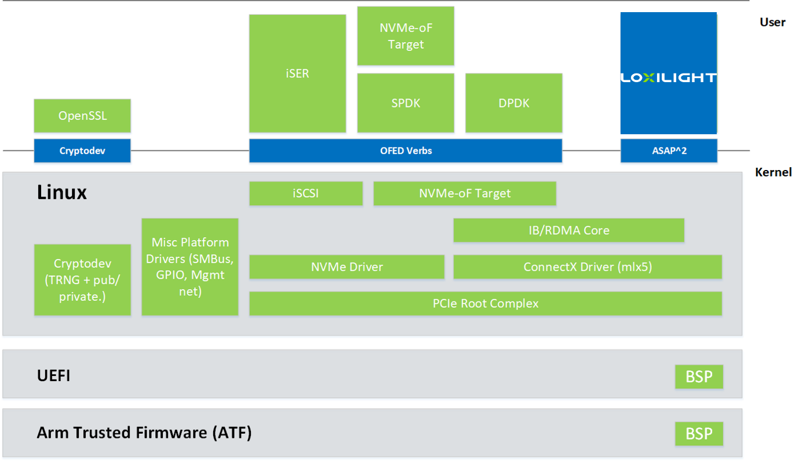
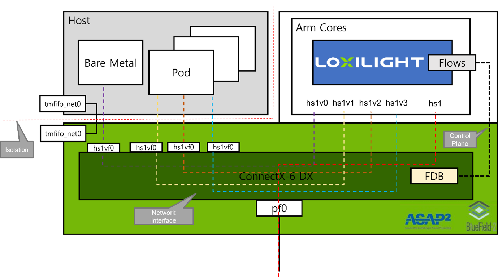

# Why DPUs ??

DPUs or Data Processing Units are new class of programmable processors, introduced with the intention to process the data efficiently which moves within or around the cluster of servers. A DPU is a system on a chip, or SoC, that combines:

1.	An industry-standard, high-performance, software-programmable, multi-core CPU, typically based on the widely used Arm architecture, tightly coupled to the other SoC components.
2.	A high-performance network interface capable of parsing, processing and efficiently transferring data at line rate, or the speed of the rest of the network, to GPUs and CPUs.
3.	A rich set of flexible and programmable acceleration engines that offload and improve applications performance for AI and machine learning, security, telecommunications, and storage, among others.

All these DPU capabilities are critical to enable an isolated, bare-metal, cloud-native computing platform that will define the next generation of cloud-scale computing.

## Bluefield2 (BF2) DPU

Currently, BF2 is one of the leading DPUs available. Loxilight fully supports Bluefield2 DPU currently.  Lets have a quick look at BF2 architecture:

The BlueField architecture is a combination of two preexisting standard off-the-shelf components, Arm AArch64 processors, and ConnectX-5 (for BlueField), ConnectX-6 Dx (for BlueField-2), or network controller, each with its own rich software ecosystem. As such, almost any of the programmer-visible software interfaces in BlueField come from existing standard interfaces for the respective components.

Kubernetes security is an immense challenge comprised of many highly interrelated parts. The shift from a monolithic model to today’s prominent microservices architecture has completely transformed the way enterprises ship applications at scale. At the same time, cloud-native applications generate intensive data movements between services and physical machines to satisfy a single application request.
The amount of traffic and latency requirements often prohibit the use of zero-trust security solutions to avoid the risk of impacting application performance. Thus, this creates inherent challenges within the enterprise for both the DevOps team, whose task is to ensure high-quality application delivery, and the security team, whose primary goal is to protect customer data and privacy.

