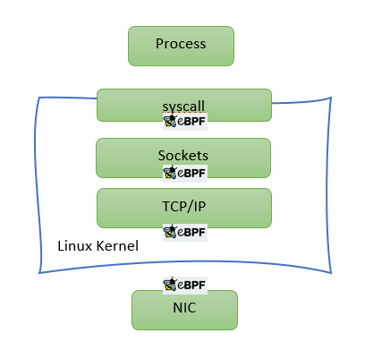
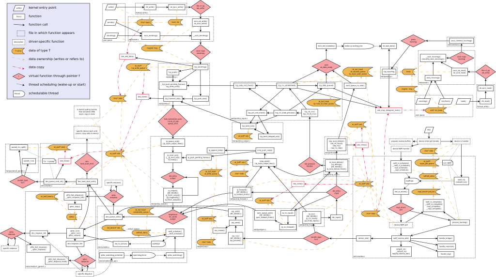

# Why eBPF ??

eBPF has been making quite some news lately.  An elegant way to extend the linux kernel (or windows)  has far reaching implications. Although initially, eBPF was used to enhance system observability beyond existing tools, we will explore in this post how eBPF can be used for enhancing Linux networking performance. 

## A quick recap

The hooks that are of particular interest for this discussion are NIC hook (invoked just after packet is received at NIC) and TC hook (invoked just before Linux starts processing packet with its TCP/IP stack).  Programs loaded to the former hook are also known as XDP programs and to the latter are called eBPF TC. Although both use eBPF restricted C syntax, there are significant differences between these types. (We will cover it in a separate blog later). For now, we just need to remember that when dealing with container-to-container or container-to-outside communication eBPF-TC makes much more sense since memory allocation (for skb) will happen either way in such scenarios.

## The performance bottlenecks

Coming back to the focus of our discussion which is of course performance, let us step back and take a look at why Linux sucks at networking performance (or rather why it could perform much faster). Linux networking evolved from the days of dial up modem networking when speed was not of utmost importance. Down the lane, code kept accumulating. Although it is extremely feature rich and RFC compliant, it hardly resembles a powerful data-path networking engine.  The following [figure](https://airtoncs.wordpress.com/2016/01/28/linux-kernel-flow-diagram/) shows a call-trace of Linux kernel networking stack:

