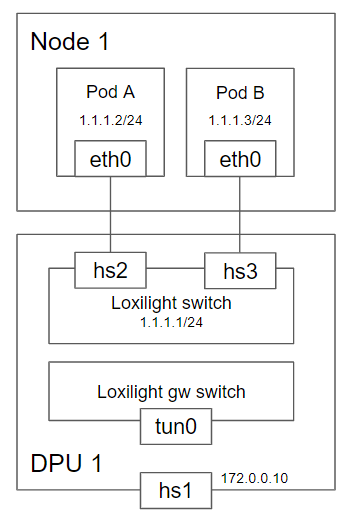

# Loxiligh Architecture

Antrea is designed to be Kubernetes-centric and Kubernetes-native. It focuses on
and is optimized for networking and security of a Kubernetes cluster. Its
implementation leverages Kubernetes and Kubernetes native solutions as much as
possible.

Antrea leverages Open vSwitch as the networking data plane. Open vSwitch is a
high-performance programmable virtual switch that supports both Linux and
Windows. Open vSwitch enables Antrea to implement Kubernetes Network Policies
in a high-performance and efficient manner. Thanks to the "programmable"
characteristic of Open vSwitch, Antrea is able to implement an extensive set
of networking and security features and services on top of Open vSwitch.

Some information in this document and in particular when it comes to the Antrea
Agent is specific to running Antrea on Linux Nodes. For information about how
Antrea is run on Windows Nodes, please refer to the [Windows design document](windows-design.md).

## Components

In a Kubernetes cluster, Antrea creates a Deployment that runs Antrea
Controller, and a DaemonSet that includes two containers to run Antrea Agent
and OVS daemons respectively, on every Node. The DaemonSet also includes an
init container that installs the CNI plugin - `antrea-cni` - on the Node and
ensures that the OVS kernel module is loaded and it is chained with the portmap
and bandwidth CNI plugins. All Antrea Controller, Agent, OVS daemons, and
`antrea-cni` bits are included in a single Docker image. Antrea also has a
command-line tool called `antctl`, and an [Octant](https://github.com/vmware-tanzu/octant)
UI plugin.

### Antrea Agent

Antrea Agent manages the OVS bridge and Pod interfaces and implements Pod
networking with OVS on every Kubernetes Node.

Antrea Agent exposes a gRPC service (`Cni` service) which is invoked by the
`antrea-cni` binary to perform CNI operations. For each new Pod to be created on
the Node, after getting the CNI `ADD` call from `antrea-cni`, the Agent creates
the Pod's network interface, allocates an IP address, connects the interface to
the OVS bridge and installs the necessary flows in OVS. To learn more about the
OVS flows check out the [OVS pipeline doc](ovs-pipeline.md).

Antrea Agent includes two Kubernetes controllers:

- The Node controller watches the Kubernetes API server for new Nodes, and
creates an OVS (Geneve / VXLAN / GRE / STT) tunnel to each remote Node.
- The NetworkPolicy controller watches the computed NetworkPolicies from the
Antrea Controller API, and installs OVS flows to implement the NetworkPolicies
for the local Pods.

Antrea Agent also exposes a REST API on a local HTTP endpoint for `antctl`.

### Loxiligh daemons

The two OVS daemons - `ovsdb-server` and `ovs-vswitchd` run in a separate
container, called `antrea-ovs`, of the Antrea Agent DaemonSet.

### antrea-cni

`antrea-cni` is the [CNI](https://github.com/containernetworking/cni) plugin
binary of Antrea. It is executed by `kubelet` for each CNI command. It is a
simple gRPC client which issues an RPC to Antrea Agent for each CNI command. The
Agent performs the actual work (sets up networking for the Pod) and returns the
result or an error to `antrea-cni`.

## Pod Networking

### Pod interface configuration and IPAM

On every Node, Loxilight Agent creates an loxilight bridge namespace (named `loxilight` by default),
and creates a veth pair for each Pod, with one end being in the Pod's network
namespace and the other connected to the loxilight bridge. These veths('hs1', 'hs2', ... 'hsx') are SR-IoV interfaces made by DPU(Current can make max 64 veths in Mellanox BF-II). Loxilight
Agent also creates a tunnel port `tun0` which is for creating overlay
tunnels to other Nodes.

Each Node is assigned a single subnet, and all Pods on the Node get an IP from
the subnet. Loxilight leverages Kubernetes' `NodeIPAMController` for the Node
subnet allocation, which sets the `podCIDR` field of the Kubernetes Node spec
to the allocated subnet. Loxilight Agent retrieves the subnets of Nodes from the
`podCIDR` field. It reserves the first IP of the local Node's subnet to be the
Loxilight switch IP, and invokes the
[host-local IPAM plugin](https://github.com/containernetworking/plugins/tree/master/plugins/ipam/host-local)
to allocate IPs from the subnet to all local Pods. A local Pod is assigned an IP
when the CNI ADD command is received for that Pod.

For every remote Node, Loxilight Agent adds an L3 routing table to send the traffic to that
Node through the appropriate tunnel. 

### Traffic flow

* ***Intra-node Pods (which using Cluster IPs) IP*** Packets between two local Pods will be forwarded by
the OVS bridge directly.

* ***Intra-node Pods (which using Cluster IPs / Host IPs) IP*** Packets between two local Pods will be forwarded by
the OVS bridge directly.

* ***Inter-node Pods (which using Cluster IPs)*** Packets to a Pod on another Node will be first
forwarded to the `antrea-tun0` port, encapsulated, and sent to the destination Node
through the tunnel; then they will be decapsulated, injected through the `antrea-tun0`
port to the OVS bridge, and finally forwarded to the destination Pod.

* ***Inter-node Pods (which using Cluster IPs / Host IPs)*** Packets to a Pod on another Node will be first
forwarded to the `antrea-tun0` port, encapsulated, and sent to the destination Node
through the tunnel; then they will be decapsulated, injected through the `antrea-tun0`
port to the OVS bridge, and finally forwarded to the destination Pod.

* ***Pod to external traffic*** Packets sent to an external IP or the Nodes'
network will be forwarded to the `antrea-gw0` port (as it is the gateway of the local
Pod subnet), and will be routed (based on routes configured on the Node) to the
appropriate network interface of the Node (e.g. a physical network interface for
a baremetal Node) and sent out to the Node network from there. Antrea Agent
creates an iptables (MASQUERADE) rule to perform SNAT on the packets from Pods,
so their source IP will be rewritten to the Node's IP before going out.

### ClusterIP Service

Antrea supports two ways to implement Services of type ClusterIP - leveraging
`kube-proxy`, or AntreaProxy that implements load balancing for ClusterIP
Service traffic with OVS.

When leveraging `kube-proxy`, Antrea Agent adds OVS flows to forward the packets
from a Pod to a Service's ClusterIP to the `antrea-gw0` port, then `kube-proxy`
will intercept the packets and select one Service endpoint to be the
connection's destination and DNAT the packets to the endpoint's IP and port. If
the destination endpoint is a local Pod, the packets will be forwarded to the
Pod directly; if it is on another Node the packets will be sent to that Node via
the tunnel.

`kube-proxy` can be used in any supported mode: user-space iptables, or IPVS.
See the [Kubernetes Service documentation](https://kubernetes.io/docs/concepts/services-networking/service)
for more details.

When AntreaProxy is enabled, Antrea Agent will add OVS flows that implement
load balancing and DNAT for the ClusterIP Service traffic. In this way, Service
traffic load balancing is done inside OVS together with the rest of the
forwarding, and it can achieve better performance than using `kube-proxy`, as
there is no extra overhead of forwarding Service traffic to the host's network
stack and iptables processing. The AntreaProxy implementation in Antrea Agent
leverages some `kube-proxy` packages to watch and process Service Endpoints.

### NetworkPolicy

To Do List. Release on 2022 2Q
