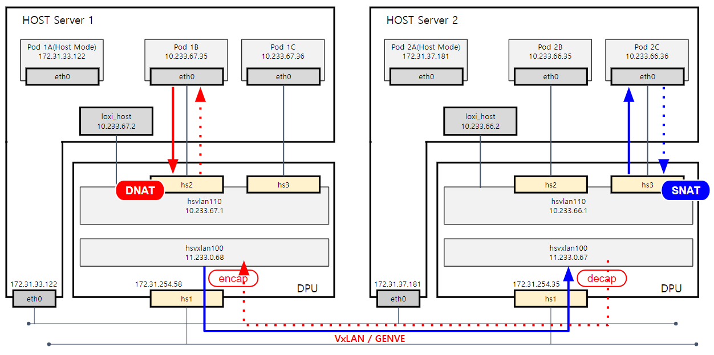

# Loxilight Architecture

Loxilight is designed to be Standalone(Network function offloading) and Kubernetes-native. It focuses on
and is optimized for networking and security with DPU(Data Processing Unit) & eBPF. Thi 

Loxilight leverages DPU & eBPF as the networking data plane. The A DPU is a new class of programmable processor that 
combines two key elements(High-Performance, Software Programmable multi-core CPU). The eBPF is a revolutionary technology that 
can run sandboxed programs in the Linux kernel without changing kernel source code or loading a kernel module.
The programmability of eBPF enables adding additional protocol parsers and easily program 
any forwarding logic to meet changing requirements without ever leaving the packet processing context of the Linux kernel.

Thanks to the "perforamce and programmability" characteristic of DPU and eBPF, Loxilight is able to implement an extensive set
of networking and security features and services on top of DPU and eBPF.

Some information in this document and in particular when it comes to the Loxilight Agent is specific to running Loxilight in a kubernetes cluster. 
For information about how Loxilight is run on bare metal server, please refer our [blog](https://netlox.medium.com/).

## Components

In a Kubernetes cluster, Loxilight creates a DaemonSet that includes one container to run Loxilight Agent
 on every Node. The DaemonSet also includes an init container that installs the CNI plugin - `loxilight-cni` - on the Node and
ensures that the loxilight service is loaded. 
User need to install whole loxilight services on the Node, please refer [doc](https://github.com/netlox-dev/loxilight-oss)

### Loxilight daemons

The one loxiligh service daemons - `loxilight` run in a host server.

### Loxilight Agent

Loxilight Agent manages the Pod interfaces and implements Pod networking with eBPF & DPU on every Kubernetes Node. 
If there is no DPU, it will implemnt pure eBPF software based.

For each new Pod to be created on the Node, after getting the CNI `ADD` call from `loxilight-cni`, the Agent creates
the Pod's network interface, allocates an IP address, connects the interface to
the bridge and installs the forwarding rules using eBPF.

Loxilight Agent includes one Kubernetes controllers:
- The Node controller watches the Kubernetes API server for new Nodes, and
creates an overlay (Geneve / VXLAN / GRE / STT) tunnel to each remote Node.

### loxilight-cni 

`loxilight-cni` is the [CNI](https://github.com/containernetworking/cni) plugin 
binary of loxilight. It is executed by `kubelet` for each CNI command. It is a 
simple gRPC client which issues an RPC to loxilight Agent for each CNI command. The 
Agent performs the actual work (sets up networking for the Pod) and returns the
result or an error to `loxilight-cni`. 

## Pod Networking

### Pod interface configuration and IPAM

On every Node, Loxilight Agent creates an loxilight bridge namespace (named `loxilight` by default),
and creates a veth pair for each Pod, with one end being in the Pod's network
namespace and the other connected to the loxilight bridge. These veths('hs1', 'hs2', ... 'hsx') are SR-IoV interfaces made by DPU(Current can make max 64 veths in Mellanox BF-II). Loxilight
Agent also creates a tunnel port `tun0` which is for creating overlay tunnels to other Nodes.

Each Node is assigned a single subnet, and all Pods on the Node get an IP from
the subnet. Loxilight leverages Kubernetes' `NodeIPAMController` for the Node
subnet allocation, which sets the `podCIDR` field of the Kubernetes Node spec
to the allocated subnet. Loxilight Agent retrieves the subnets of Nodes from the
`podCIDR` field. It reserves the first IP of the local Node's subnet to be the
Loxilight switch IP (`hsvlan110`) and the second IP of the host interface(`loxi_host`) to communicate with
eBPF(+DPU) namespace domain. And invokes the
[host-local IPAM plugin](https://github.com/containernetworking/plugins/tree/master/plugins/ipam/host-local)
to allocate IPs from the subnet to all local Pods. A local Pod is assigned an IP
when the CNI ADD command is received for that Pod.

For every remote Node, Loxilight Agent adds an L3 routing table to send the traffic to that
Node through the appropriate tunnel. 

### Traffic flow

* ***Intra-node Pods (which using Cluster IPs) IP*** Packets between two local Pods will be forwarded by
the loxilight bridge directly. If this bridge installed on DPU, it will be offloaded to DPU hardware.

* ***Intra-node Pods (which using Cluster IPs / Host IPs) IP*** This case is some specific case which local Pod's location is different.
For example, one Pod is running on Host Server using `Host Network Mode` and ther other is running on `Cluster Network Mode`.
In this case, Packets will be forwaded to `loxi_host` using L3 routing table.

* ***Inter-node Pods (which using Cluster IPs)*** Packets to a Pod on another Node will be first
forwarded to the `hsvxlan100` bridge(which is VTEP) port, encapsulated, and sent to the destination Node
through the tunnel; then they will be decapsulated, injected through the `hsvxlan100` bridge, 
and finally forwarded to the destination Pod using L3 routing table.

* ***Inter-node Pods (which using Cluster IPs / Host IPs)*** Packets to a Pod(using `Host Network Mode`) on another Node.

* ***Pod to external traffic*** Packets sent to an external IP or the Nodes'
network will be forwarded to the `loxi_host` port (as it is the gateway of the local
Pod subnet), and will be routed (based on routes configured on the Node) to the
appropriate network interface of the Node (e.g. a physical network interface for
a baremetal Node) and sent out to the Node network from there. Loxilight Agent
creates an iptables (MASQUERADE) rule to perform SNAT on the packets from Pods,
so their source IP will be rewritten to the Node's IP before going out.

### ClusterIP Service

Loxilight implements Services of type ClusterIP - leveraging
that implements load balancing for ClusterIP Service traffic with ebpf & DPU.

Loxilight Agent will add forwarding rules that implement
load balancing and DNAT for the ClusterIP Service traffic. In this way, Service
traffic load balancing is done inside ebpf & DPU together with the rest of the
forwarding, and it can achieve better performance than using `kube-proxy`, as
there is no extra overhead of forwarding Service traffic to the host's network
stack and iptables processing. 

## NetworkPolicy

To Do List. Release on 2022 2Q
